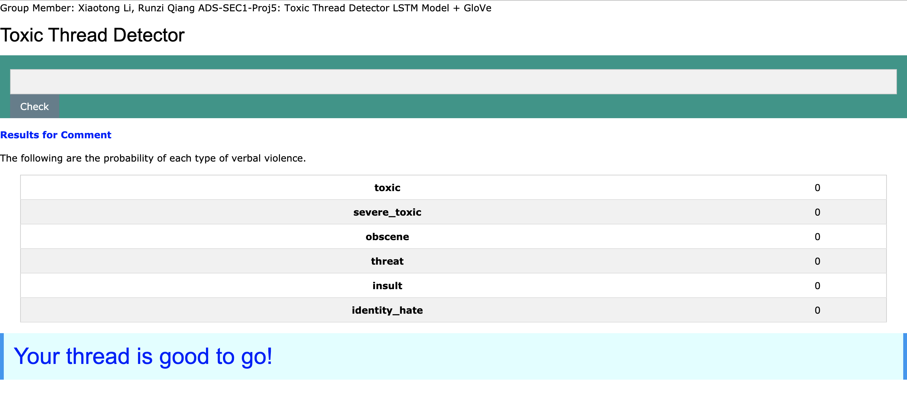

# ADS Project 5: Toxic Thread Detector

Term: Fall 2019

+ Team Section1 Group4
+ Projec title: Toxic online comments detector
+ Team members
	+ Xiaotong Li (xl2788)
	+ Runzi Qiang (rq2156)
	
+ Project summary: We developed a web on a topic of identifing and classifing toxic online comments, the dataset we used are originally from kaggle(https://www.kaggle.com/c/jigsaw-toxic-comment-classification-challenge/data). We totally build three models that predicts a probability of each type of toxicity for each comment.

**Contribution statement**: ([default](doc/a_note_on_contributions.md)) All team members contributed equally in all stages of this project. All team members approve our work presented in this GitHub repository including this contributions statement. 


__Instruction to open the app__:
+ Download the dataset from kaggle. save the data to the --data/ folder
+ Please download glove.6B.100d.txt from this website: https://www.kaggle.com/terenceliu4444/glove6b100dtxt and change the path. Suggested to save it to data/glove/glove6b100dtxt
+ Run the main.ipynb and run the model. Save both the model and tokenizer to the /app/model folder
+ Run the app.py file and you can test our app freely!


Following [suggestions](http://nicercode.github.io/blog/2013-04-05-projects/) by [RICH FITZJOHN](http://nicercode.github.io/about/#Team) (@richfitz). This folder is orgarnized as follows.

```
proj/
├── app/
├────── model/
├────── templates/
├────── static/
├────── venv/
├── data/
├── doc/
├── figs/
└── output/
```

Please see each subfolder for a README file.
